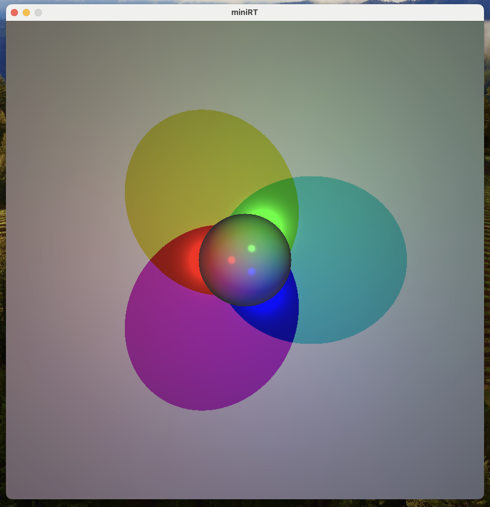

# miniRT 
## - Mi Primer RayTracer con miniLibX
<p align="center">
  
</p>

## Introducción al Ray Tracing

El Ray Tracing es una técnica computacional para el renderizado de imágenes que simula el comportamiento de la luz en un ambiente tridimensional. A diferencia de la rasterización, utilizada por la mayoría de los motores gráficos por su eficiencia, el Ray Tracing ofrece un realismo visual mucho más elevado aunque a un mayor coste computacional. El proyecto miniRT es una introducción a este fascinante mundo, permitiéndote renderizar imágenes generadas por computadora con objetos geométricos simples y sistemas de iluminación.

<p align="left">
  
</p>

## Estructura del Proyecto

El proyecto está organizado en varios directorios que separan las funcionalidades de manera clara:

- `src/classes`: Contiene las clases para objetos básicos como vectores y rayos.
- `src/light`: Gestiona la iluminación.
- `src/main`: El punto de entrada del programa.
- `src/parser`: Parsea los archivos de escena.
- `src/render`: Encargado del cálculo de rayos y el renderizado.
- `src/utils`: Funciones auxiliares y de utilidad.
- `src/window`: Gestiona eventos y la ventana de visualización.

## Compilación y Ejecución

Para compilar el proyecto, simplemente ejecuta:

```bash
make
```

Esto compilará `miniRT` junto con todas sus dependencias. Para ejecutar el programa y renderizar una escena:

```bash
./miniRT scenes/scene.rt
```

### Opciones de Compilación

- `make all`: Compila todos los componentes necesarios.
- `make clean`: Elimina archivos objeto.
- `make fclean`: Limpieza total incluyendo el ejecutable.
- `make re`: Re-compila todo el proyecto.
- `make reflect`: Añade reflejos especulares para un modelo completo de reflexión de Phong.
- `make checkerboard`: Añade patrones de tablero de ajedrez a los objetos.

## Funcionalidades

El programa es capaz de renderizar imágenes utilizando varios tipos de objetos geométricos como esferas, planos y cilindros, y soporta transformaciones como traslación y rotación. La gestión de la luz incluye iluminación ambiental y sombras duras, mostrando las imágenes en una ventana gráfica que puede interactuar con el usuario.

## Conclusión

miniRT es un proyecto introductorio al Ray Tracing que demuestra que con bases matemáticas sólidas y programación en C, se pueden crear imágenes realistas. Este proyecto no solo desafía tu comprensión de la computación gráfica sino también tu habilidad para implementar y estructurar un software complejo.

## Contacto

- **Nombre:** Pablo Palma Rodíguez
- **GitHub:** [GitHub](https://github.com/Pablo-Palma)
- **LinkedIn:** [LinkedIn](https://linkedin.com/in/pablopalmarodríguez)

---
miniRT © 2024 Pablo Palma Rodríguez.
